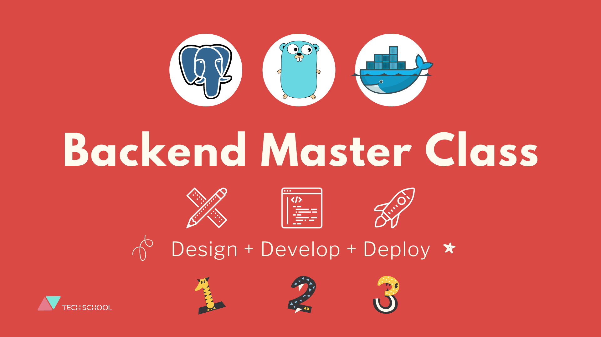

# Simple Bank

This repository contains the codes of the [Backend master class](https://bit.ly/backendmaster) course by [TECH SCHOOL](https://dev.to/techschoolguru).



In this backend master class, we’re going to learn everything about how to design, develop, and deploy a complete backend system from scratch using PostgreSQL, Golang and Docker.

Course videos:

- Lecture #1: [Design DB schema and generate SQL code with dbdiagram.io](https://www.youtube.com/watch?v=rx6CPDK_5mU&list=PLy_6D98if3ULEtXtNSY_2qN21VCKgoQAE&index=1)
- Lecture #2: [Install & use Docker + Postgres + TablePlus to create DB schema](https://www.youtube.com/watch?v=Q9ipbLeqmQo&list=PLy_6D98if3ULEtXtNSY_2qN21VCKgoQAE&index=2)
- Lecture #3: [How to write & run database migration in Golang](https://www.youtube.com/watch?v=0CYkrGIJkpw&list=PLy_6D98if3ULEtXtNSY_2qN21VCKgoQAE&index=3)
- Lecture #4: [Generate CRUD Golang code from SQL | Compare db/sql, gorm, sqlx & sqlc](https://www.youtube.com/watch?v=prh0hTyI1sU&list=PLy_6D98if3ULEtXtNSY_2qN21VCKgoQAE&index=4)
- Lecture #5: [Write unit tests for database CRUD with random data in Golang](https://www.youtube.com/watch?v=phHDfOHB2PU&list=PLy_6D98if3ULEtXtNSY_2qN21VCKgoQAE&index=5)
- Lecture #6: [A clean way to implement database transaction in Golang](https://www.youtube.com/watch?v=gBh__1eFwVI&list=PLy_6D98if3ULEtXtNSY_2qN21VCKgoQAE&index=6)
- Lecture #7: [DB transaction lock & How to handle deadlock in Golang](https://www.youtube.com/watch?v=G2aggv_3Bbg&list=PLy_6D98if3ULEtXtNSY_2qN21VCKgoQAE&index=7)
- Lecture #8: [How to avoid deadlock in DB transaction? Queries order matters!](https://www.youtube.com/watch?v=qn3-5wdOfoA&list=PLy_6D98if3ULEtXtNSY_2qN21VCKgoQAE&index=8)
- Lecture #9: [Deeply understand transaction isolation levels & read phenomena in MySQL & PostgreSQL](https://www.youtube.com/watch?v=4EajrPgJAk0&list=PLy_6D98if3ULEtXtNSY_2qN21VCKgoQAE&index=9)

## Simple bank service

The service that we’re going to build is a simple bank. It will provide APIs for the frontend to do following things:

1. Create and manage bank accounts, which are composed of owner’s name, balance, and currency.
2. Record all balance changes to each of the account. So every time some money is added to or subtracted from the account, an account entry record will be created.
3. Perform a money transfer between 2 accounts. This should happen within a transaction, so that either both accounts’ balance are updated successfully or none of them are.

## Setup local development

### Install tools

- [Docker desktop](https://www.docker.com/products/docker-desktop)
- [TablePlus](https://tableplus.com/)
- [Golang](https://golang.org/)
- [Homebrew](https://brew.sh/)
- [Migrate](https://github.com/golang-migrate/migrate/tree/master/cmd/migrate)

    ```bash
    brew install golang-migrate
    ```

- [Sqlc](https://github.com/kyleconroy/sqlc#installation)

    ```bash
    brew install golang-migrate
    ```

### Setup infrastructure

- Start postgres container:

    ```bash
    make postgres
    ```

- Create simple_bank database:

    ```bash
    make createdb
    ```

- Run db migration:

    ```bash
    make migrateup
    ```

### How to run

- Run test:

    ```bash
    make test
    ```
